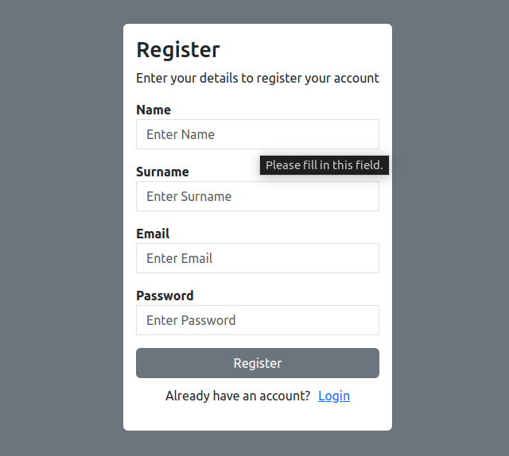
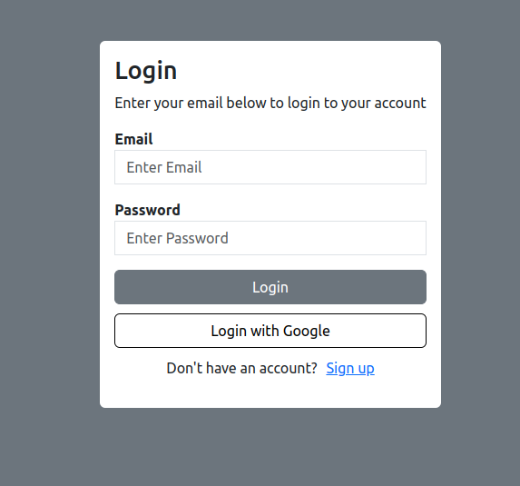
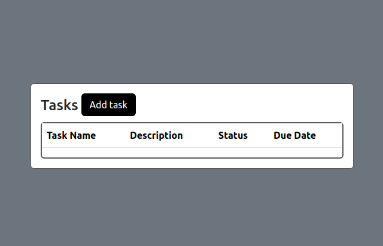
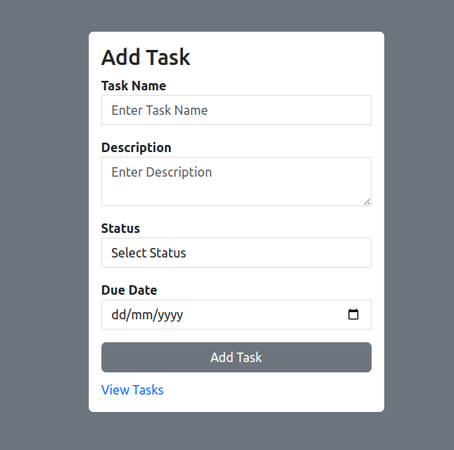
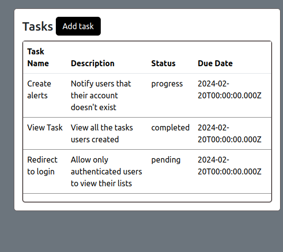

# Legend-Task-Manager
Web application that aims to streamline task organisation for individuals and teams by providing a user-friendly interface and robust backend functionality.

## Tools used (MERN STACK)
- Language: Javascript
- Backend: NodeJS / expressJs
- Frontend: ReactJS
- Database: MongoDB
- API Testing : Postman

##  Installation
1. ```https://github.com/mokhutso-dev/Legend.git```
2. ```cd server && npm install```
3. ```touch .env``` then add MONGODB_URI and PORT as your variables
3. ```cd client && npm install```


## How to run the project
#### Frontend
- ```cd client```
- ```npm run dev```

#### Backend
- ```cd server```
- ```npm run dev```


## Routes
- ```http://localhost:5173/register```
    - To create account

- ```http://localhost:5173/login```
    - To login into your account


- ```http://localhost:5173/add```
    - To add tasks


- ```http://localhost:5173/```
    - To view all tasks


# Screenshot
- Registration page

- Login page

- Empty list before adding tasks to the database

- Add task page

- View all tasks added to the database



<br>
<hr>

Enjoy my Fullstack Task Manager!

